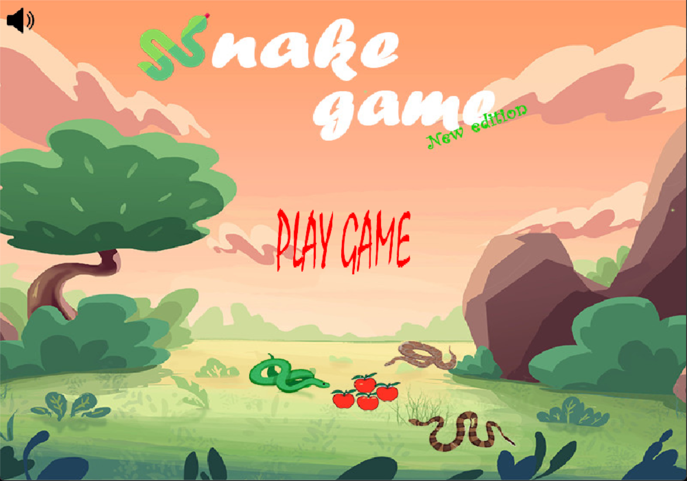

# GameSnake
## Giới thiệu
+ Họ và tên : Đặng Xuân Đào
+ Mã sinh viên : 24020059
+ Môn học : Lập trình nâng cao
+ Mã lớp học : INT2215_4
+ Bài tập : Rắn săn mồi
## Mô tả
+ Một trò chơi Rắn săn mồi cổ điển được viết bằng C++ với thư viện SDL2, hỗ trợ đồ họa, âm thanh và giao diện người dùng đơn giản.
+ Hình ảnh đẹp, độc đáo, đơn giản
+ Âm thanh sinh động, thoải mái khi chơi

  
  
### Thư viện yêu cầu
+ SDL2
+ SDL2_image
+ SDL2_ttf
+ SDL2_mixer
### Tính năng
+ Giao diện menu và game over đơn giản
+ Có thể bật, tắt âm thanh
+ Ấn nút Esc để tạm dừng hoặc tiếp tục chơi
+ Tính điểm, lưu và đặt lại điểm số cao nhất trong các lần chơi
+ Hiệu ứng âm thanh khi ăn mồi và khi game over
### Cách chơi
| Điều khiển | Player 1 | 
|------------|----------|
| UP         |     ↑    |
| DOWN       |     ↓    |
| LEFT       |     ←    |
| RIGHT      |     →    |
+ Mỗi lần ăn được mồi sẽ cộng thêm 10 điểm
+ Nếu di chuyển rắn chạm vào chính nó thì trò chơi sẽ kết thúc
## Nguồn tham khảo
+ Cách cài đặt thư viện SDL trên Visual Studio Code : https://www.youtube.com/watch?v=cnykbzuGo8I
+ Hình ảnh : https://github.com/trongminh03/Snake-Game
+ Âm thanh, hiệu ứng : Tra trên google 
+ Thuật toán : Tham khảo AI
